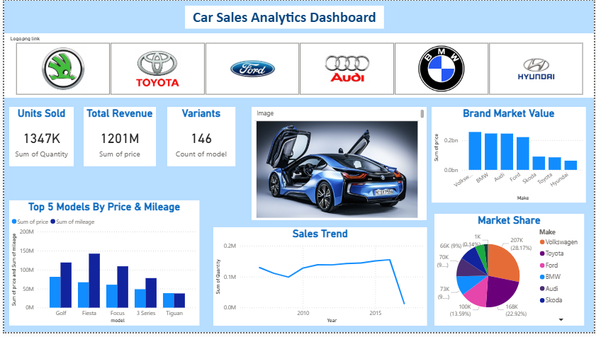

# 🚗 Car Sales Analytics Dashboard

## 📌 Project Overview

The **Car Sales Analytics Dashboard** is developed as part of the **Data Analysis and Visualization (DAV)** course. This dashboard analyzes car sales data to provide insights into **units sold, revenue, variants, market value, and sales trends** across different car brands and models.

The dashboard helps in understanding **brand performance, top models, and market share** using interactive visualizations.

---

## 📂 Datasets Used

The following datasets were used in this project:

* **Brands_Master_Data** – Brand-level information and mapping
* **cars_dataset** – Model, price, mileage, and variant data
* **Norway_car_sales_by_model** – Time-series sales data by car model

---

## 🎯 Business Questions Solved

This dashboard answers the following questions:

1. Display the **units sold for each car brand**
2. Calculate **revenue generated for each car model**
3. Display **number of variants available for each car model**
4. Show **market value for each car brand using Bar chart**
5. Display **Top 5 models (variants) for each brand based on revenue**
6. Show **market share percentage of brands**
7. Show **trend of sales over time for each car model**

---

## 📊 Dashboard KPIs

* **Units Sold** : 1347K
* **Total Revenue** : 1201M
* **Variants** : 146 Models

---

## 📈 Visualizations Used

The dashboard includes the following charts:

* Units Sold KPI Card
* Total Revenue KPI Card
* Variants Count Card
* Brand Market Value (Bar Chart)
* Top 5 Models by Price & Mileage (Column Chart)
* Market Share (Pie Chart)
* Sales Trend Over Time (Line Chart)
* Brand Logo Filter Panel

---

## 📊 Dashboard Features

* Brand-wise sales analysis
* Model-wise revenue comparison
* Variant availability analysis
* Market share visualization
* Time series sales trend
* Top performing models
* Interactive filtering by brand

---

## 📸 Dashboard Preview



---

## 🛠️ Tools Used

* Power BI
* Excel / CSV Dataset
* GitHub

---

## 📁 Project Structure

```
Car-Sales-Analytics-Dashboard
│
├── Dataset/
│   └── cars_dataset
│   └── Norway_car_sales_by_model
│
├── A2_20_AnyaPorwal_DAV_Project.pbix
├── Dashboard.png
└── README.md
```

---

## 🚀 Key Insights

* Volkswagen and Toyota dominate market share
* Few models contribute majority of revenue
* Sales trend shows growth followed by recent drop
* Premium brands have higher market value

---
